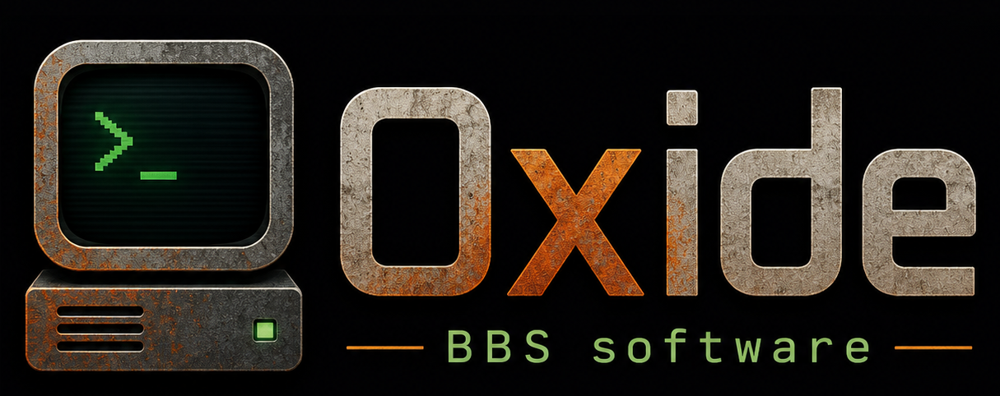
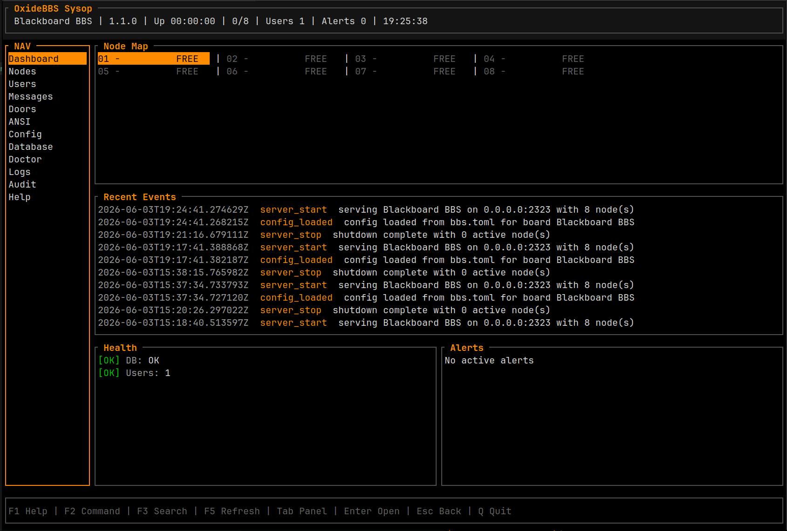

<p align="center">
    
</p>

<p align="center">
    <a href="https://www.rust-lang.org">
        
    </a>
    <a href="LICENSE">
        
    </a>
    <a href="https://github.com/sphildreth/oxidebbs/actions/workflows/ci.yml">
        
    </a>
    <a href="https://github.com/sphildreth/oxidebbs/releases">
        
    </a>
    <a href="https://oxidebbs.com">
        
    </a>
</p>

# OxideBBS

**OxideBBS** is a modern Rust BBS engine for telnet and serial callers,
ANSI/CP437 screens, DecentDB persistence, local sysop operations, FTN/OxideNet
networking, caller file transfers, and DOS door games.

It keeps the caller experience byte-oriented and classic while giving sysops a
clean Rust codebase, a real database layer, auditable runtime operations,
operational health checks, Docker deployment, and a GitHub-native release
workflow.

OxideBBS remains a modern Rust server. C64, C64 Ultimate, and C64 terminal
application users are supported as remote callers through a C64-friendly
terminal profile; this is not a C64-native server port.

> **Built for sysops. Driven by code.**

## Features

- 📡 **Telnet And Serial Caller Runtime** - Multi-node telnet serving plus
  disabled-by-default physical serial/modem devices, with session lifecycle
  tracking, idle timeout handling, graceful shutdown, and live node state.
- 🎨 **ANSI/CP437-First UI** - Raw ANSI assets, CP437 conversion, C64-friendly
  40-column plain/PETSCII-fallback caller profile, 80-column ANSI profile,
  paging, caller-safe prompts, and CRLF-normalized telnet output.
- 🧭 **Configurable Menus** - Login, main, info, message, door, logoff, and
  nested submenu routing with hotkey-driven caller commands.
- 👤 **Accounts And Auth** - New-user creation, Argon2id password hashing,
  sysop accounts, security levels, persistent lockout state, and audit-friendly
  login outcomes.
- 💬 **Local Message Areas** - DecentDB-backed message areas, posting, reading,
  replies, private-mail foundation, moderation fields, and SQL-side visibility
  filtering.
- 📁 **Caller File Areas And Transfers** - File-area management, ZMODEM
  send/receive, XMODEM-CRC fallback, upload sanitization, pending-review
  uploads, transfer history, and binary-safe caller transport handling.
- 🕹️ **DOS Door Compatibility** - DOSEMU2-based live door launches, `DOOR.SYS`,
  `DORINFO1.DEF`, `CHAIN.TXT`, `DOORFILE.SR`, `PCBOARD.SYS`, and
  `CALLINFO.BBS` drop files, per-node runtime directories, byte bridging,
  timeout cleanup, and durable `door_runs` records.
- 🌐 **Remote Door Providers** - BBSLink and DoorParty-style provider adapters,
  local dry-run checks, DecentDB-backed provider credentials, and redacted
  secret display across sysop surfaces.
- 🧪 **Bundled Door Fixture** - Oxide-owned `oxide-check` DOS test door for
  validating drop files, DOSEMU2 command planning, and live COM1 byte flow
  without bundling third-party doorware.
- 🛰️ **FTN And BinkP Networking** - Type-2 packet I/O, echomail toss/scan,
  netmail routing, bundles, nodelists/nodediffs, AreaFix, BinkP polling and
  listener support, TLS modes, retries, queues, packet retention, and stats.
- 🧬 **OxideNet** - First-party FTN-style network profile with application
  review, address assignment, credential lifecycle, config package generation
  and import, nodelist publication, suspended-node enforcement, and CLI/TUI
  operations.
- 🗄️ **DecentDB Persistence And Maintenance** - [DecentDB](https://github.com/sphildreth/decentdb) is the only system database, with
  schema markers, migrations, users, sessions, messages, doors, file transfers,
  network state, audit events, doctor checks, verify, backup, export, import,
  compaction, and audit purge operations.
- 🧑‍💻 **Sysop CLI And TUI** - Local CLI commands plus a Ratatui sysop console
  for dashboard, nodes, users, doors, files, messages, database, logs, config,
  ANSI, audit, doctor, network, OxideNet, and read-only workflows.
- 🔌 **Local Control Socket** - Same-UID Unix control channel for live status,
  node list/show, disconnects, direct node messages, broadcasts, and stale-node
  recovery.
- 🩺 **Remote Monitoring And Health Surface** - Opt-in loopback monitoring web
  listener with a human-readable root page, `/status`, doctor-backed `/health`,
  `/healthz`, `/healtz`, sysop-authenticated read-only JSON APIs, CSRF/replay
  protections, origin checks, rate limits, and read-only mutation blocking.
- 📝 **Operational Logs And Audit Trail** - Configurable text or JSON logs,
  rotation, monitoring web activity lines, audit retention, startup/shutdown
  events, door events, auth events, and sysop action records.
- 🐳 **Docker Deployment** - Cross-platform Docker Compose path for Windows,
  macOS, and Linux hosts with OxideBBS, DOSEMU2, assets, config, and the test
  door inside a Linux runtime image.
- 🚢 **Release Automation** - Version metadata alignment, release archive smoke
  checks, checksum verification, docs builds, Docker smoke checks, optional
  DOSEMU2 smoke automation, and Codeberg mirror dry-run automation.
- 🧱 **Modular Rust Workspace** - Focused crates for server, core domain, term,
  telnet, serial/file transfer helpers, DecentDB repositories, doors, FTN,
  BinkP, OxideNet, and local sysop tooling.

## Sysop TUI

<p align="center">
    
</p>

## Quick Start With Docker

Docker Compose is the recommended cross-platform deployment path. It includes
DOSEMU2 and the bundled Oxide-owned test door fixture.

```bash
OXIDEBBS_SYSOP_PASSWORD='choose-a-real-password' docker compose up -d --build
```

Connect with SyncTERM, telnet, or a C64/C64 Ultimate terminal client:

```bash
telnet localhost 2323
```

Common Docker sysop commands:

```bash
docker compose run --rm oxidebbs status
docker compose run --rm oxidebbs nodes list
docker compose run --rm oxidebbs doors check oxide-check
docker compose run --rm oxidebbs doors test oxide-check --user sysop --dry-run
```

See [docs/project/docker.md](docs/project/docker.md) for first-boot variables,
volumes, reset steps, door testing, and Windows/macOS notes.

## Install From Releases

GitHub Releases publish `oxidebbs-server` packages and SHA-256 checksums for:

- `oxidebbs-<tag>-linux-x86_64-gnu.tar.gz`
- `oxidebbs-<tag>-macos-x86_64.tar.gz`
- `oxidebbs-<tag>-windows-x86_64-msvc.zip`

Each package includes the server binary, bundled assets, example configs, the
Oxide-owned `oxide-check` test door fixture, license files, and security policy.
Manual release workflow dispatches default to a dry run that builds and smokes
all three archive formats, verifies checksums, builds docs, and builds the
Docker image without uploading artifacts.
Docker remains the simplest deployment path for Windows and macOS sysops who
want DOS door support because live door execution targets a Linux runtime with
DOSEMU2.

## Build From Source

Prerequisites:

- Rust stable with `rustfmt` and `clippy`
- `clang` and `libclang-dev` for DecentDB's native build integration
- DOSEMU2 for live DOS door execution
- Node.js for building the documentation site

On Debian/Ubuntu:

```bash
sudo apt-get install -y clang libclang-dev
```

Create a local board:

```bash
cargo run -p oxidebbs-server -- setup
```

Validate the configuration:

```bash
cargo run -p oxidebbs-server -- check
cargo run -p oxidebbs-server -- config check
```

Start the telnet listener:

```bash
cargo run -p oxidebbs-server -- serve
```

After `setup`, OxideBBS uses `config/oxidebbs.toml` by default. A clean checkout
without that file falls back to `config/oxidebbs.example.toml`.

## Sysop Operations

OxideBBS is local-admin-first. Mutating sysop operations live in the CLI, the
local sysop TUI, and the same-UID local control socket. The optional monitoring
web listener is intended for loopback status, health checks, and authenticated
read-only JSON views.

```bash
cargo run -p oxidebbs-server -- status
cargo run -p oxidebbs-server -- nodes list
cargo run -p oxidebbs-server -- users list
cargo run -p oxidebbs-server -- messages areas list
cargo run -p oxidebbs-server -- doors list
cargo run -p oxidebbs-server -- files areas list
cargo run -p oxidebbs-server -- net status oxidenet
cargo run -p oxidebbs-server -- logs recent
cargo run -p oxidebbs-server -- db doctor
```

Launch the local sysop TUI:

```bash
cargo run -p oxidebbs-server -- sysop
```

The TUI can attach to a running server through
`runtime/oxidebbs-control.sock`; when no socket is available it can start an
embedded serve runtime for the TUI session. Selectable themes include
`oxide-classic`, `wildcat`, `telegard`, `vbbs`, `mystic`, `midnight`, and
`high-contrast`.

When `[admin_web]` is enabled, the loopback listener exposes a landing page and
monitoring-friendly health checks. `/status` is public only when
`public_status_enabled = true`. OxideBBS serves this listener as plain HTTP
only; use a local reverse proxy such as Caddy for HTTPS/TLS termination.

```bash
curl http://127.0.0.1:8080/
curl http://127.0.0.1:8080/health
curl http://127.0.0.1:8080/status
```

## Doors

OxideBBS isolates door execution from core session logic. Local DOS doors run
through DOSEMU2 with compatibility drop files, while remote provider entries
connect to BBSLink and DoorParty-style services without changing the caller
menu flow. A live local DOS door session uses this byte path:

```text
caller telnet client
  <-> OxideBBS caller transport
  <-> OxideBBS PTY byte bridge
  <-> DOSEMU2 COM1 pts backend
  <-> DOSEMU2-emulated COM1 UART
  <-> DOS door program
```

Validate the bundled `oxide-check` fixture without launching a live caller
session:

```bash
cargo run -p oxidebbs-server -- --config config/oxidebbs.example.toml doors check oxide-check
cargo run -p oxidebbs-server -- --config config/oxidebbs.example.toml doors dropfile oxide-check --user sysop --node 1 --format DORINFO1.DEF
cargo run -p oxidebbs-server -- --config config/oxidebbs.example.toml doors test oxide-check --user sysop --dry-run
```

Supported local drop-file writers include `DOOR.SYS`, `DORINFO1.DEF`,
`CHAIN.TXT`, `DOORFILE.SR`, `PCBOARD.SYS`, and `CALLINFO.BBS`.

OxideBBS does not bundle copyrighted or abandonware DOS doors. Add third-party
doors only when you have the rights to run and distribute them.

## Documentation

The documentation site is published at [oxidebbs.com](https://oxidebbs.com).
Source lives in [docs/](docs/).

```bash
npm ci
npm run docs:dev
npm run docs:build
```

Useful docs:

- [Getting Started](docs/project/getting-started.md)
- [Deployment and Operations](docs/project/deployment.md)
- [Docker Deployment](docs/project/docker.md)
- [Sysop CLI](docs/project/sysop-cli.md)
- [Remote Monitoring And Health](docs/project/remote-admin.md)
- [Caller Commands](docs/project/caller-commands.md)
- [Serial And Modem Transport](docs/project/serial.md)
- [File Transfers](docs/project/file-transfers.md)
- [Doors](docs/project/doors.md)
- [FTN Architecture](docs/ftn/architecture.md)
- [BinkP](docs/ftn/binkp.md)
- [OxideNet](docs/oxidenet/overview.md)
- [Architecture](docs/project/architecture.md)
- [Release v1.2 Plan](design/RELEASE_v1_2_PLAN.md)
- [Changelog](docs/about/changelog.md)

## Repository Layout

```text
.
├── crates/
│   ├── oxidebbs-server/     # binary entrypoint, CLI, telnet server
│   ├── oxidebbs-core/       # users, sessions, nodes, permissions, menus
│   ├── oxidebbs-term/       # ANSI/CP437 rendering and terminal helpers
│   ├── oxidebbs-telnet/     # telnet transport and negotiation
│   ├── oxidebbs-db/         # DecentDB repository layer and schema helpers
│   ├── oxidebbs-door/       # door metadata, drop files, runners
│   ├── oxidebbs-sysop/      # local Ratatui sysop console and services
│   ├── oxidebbs-transfer/   # file-transfer protocols (ZMODEM, XMODEM-CRC)
│   ├── oxidebbs-network/    # shared network protocol types and tables
│   ├── oxidebbs-ftn/        # legacy FTN packet engine and tosser/scanner
│   ├── oxidebbs-binkp/      # BinkP client/server for FTN/OxideNet transport
│   └── oxidebbs-oxidenet/   # OxideNet first-party network profile
├── assets/                  # bundled ANSI, ASCII, text, and screen assets
├── config/                  # example board and door configuration
├── design/                  # specs, roadmap, ADRs, and architecture notes
├── docs/                    # VitePress documentation site
├── graphics/                # project logo and README graphics
├── scripts/                 # development and door validation scripts
└── tools/doors/             # Oxide-owned DOS test door fixture
```

## Development

The CI gate is:

```bash
./scripts/dev-check.sh
```

It runs:

```bash
cargo fmt --all --check
cargo check --workspace --locked
cargo test --workspace --locked
cargo clippy --workspace --all-targets --locked -- -D warnings
```

Use `--locked` when validating Rust changes because `Cargo.lock` is committed.
Meaningful behavior, architecture, config, or product-scope changes should also
update the relevant design docs and ADRs.

## Contributing

Issues and pull requests are welcome. Start with
[CONTRIBUTING.md](CONTRIBUTING.md), keep the caller experience ANSI-first, and
run `./scripts/dev-check.sh` before submitting changes.

## Security

Report security issues privately to the repository owner. See
[SECURITY.md](SECURITY.md) for the current policy and priorities.

## License

OxideBBS is licensed under the Apache License, Version 2.0. See
[LICENSE](LICENSE) and [NOTICE](NOTICE). The repository licensing decision and
contribution policy are recorded in
[design/adr/0007-use-github-and-apache-2.md](design/adr/0007-use-github-and-apache-2.md).
